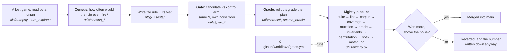

# Architecture

Three views of the same repository: what ships, how a decision is made, and the
instruments that decide whether a change is kept. Prose version in
[docs/code-map.md](../docs/code-map.md); the layer rules are enforced by
`utils/lint_architecture.py`.

## 1. The whole project

Everything above the dotted line is packaged into `submission.tar.gz`; everything
below it is measurement and never reaches the container.

```mermaid
flowchart TB
    subgraph SHIPPED["SHIPPED — submission.tar.gz"]
        direction TB
        MAIN["<b>main.py</b><br/>agent&#40;observation&#41; -&gt; list[int]<br/>board setup · opponent id · flags"]

        subgraph PTCG["ptcg/ — the agent's package, layered by permission"]
            direction BT
            CARDS["<b>cards/</b> — DATA<br/>ids · groups · lines · costs<br/>tables · scoring · op_scaling"]
            CALC["<b>calc/</b> — PURE READINGS<br/>damage · energy · grass · board<br/>card · opponent · probability"]
            ENGINE["<b>engine/</b> — MACHINERY<br/>rules · context · plan · debug"]
            STATE["<b>state/</b> — WHAT PERSISTS<br/>AGENT_STATE · tracking · zones · logs"]
            DECISION["<b>decision/</b> — PER-CARD<br/>ultra_ball · boss_orders · meowth<br/>disruption · night_stretcher · stadiums<br/>supporters · poke_pad · bug_catching_set"]
            TURN["<b>turn/</b> — THE TURN<br/>game_plan · scoring · options/<br/>energy · supporters · finalize"]

            CALC --> CARDS
            ENGINE --> CALC
            STATE --> CARDS
            DECISION --> ENGINE
            DECISION --> STATE
            TURN --> DECISION
        end

        CG["<b>cg/</b> — vendored simulator<br/>api · game · battle · sim<br/>+ native library"]
        DECK["<b>deck.csv</b><br/>our 60 cards"]

        MAIN --> TURN
        MAIN --> DECISION
        MAIN --> STATE
        MAIN --> ENGINE
        MAIN --> CALC
        MAIN --> CARDS
        MAIN -->|"types and card data only"| CG
        MAIN -.reads.-> DECK
    end

    subgraph SHADOW["SHADOW INSTRUMENTS — never imported by main.py (R11, R12)"]
        direction LR
        SEARCH["<b>ptcg/search/</b><br/>arbiter · fast_policy<br/>rollouts, stateless"]
        OPP["<b>ptcg/opponent/</b><br/>prior over 133 real lists"]
        LOCALENG["<b>ptcg_engine/</b>, <b>cg/build/</b><br/>seedable local engine"]
    end

    subgraph HARNESS["MEASUREMENT HARNESS — dev only"]
        direction LR
        TESTS["<b>tests/</b><br/>behaviour tests · fixtures<br/>frozen corpus · kaggle_loader"]
        UTILS["<b>utils/</b><br/>selfplay · gates · censuses · oracles<br/>autopsy · matchup_matrix · nightly"]
        DATA["<b>deck/</b> · <b>competitor_decks*/</b> · <b>dataset/</b><br/>opponent lists · card reference"]
        OUT["<b>records/</b> · <b>log/</b> · <b>log_analisys/</b><br/>throwaway game data, git-ignored"]
    end

    PKG["<b>utils/package_project.py</b><br/>AST packer: follows main.py's imports"]

    SHIPPED -.-> PKG
    PKG --> TAR["submission.tar.gz"]

    TESTS --> SHIPPED
    UTILS --> SHIPPED
    UTILS --> SEARCH
    UTILS --> OPP
    UTILS --> LOCALENG
    UTILS --> DATA
    UTILS --> OUT
    SEARCH --> LOCALENG
```



## 2. One decision, at runtime

The simulator hands over a state plus the menu of options that are legal right
now; the agent returns indexes into that menu.

```mermaid
flowchart TB
    OBS["Observation<br/>state + legal option menu"] --> AGENT["main.agent&#40;&#41;"]

    AGENT --> SETUP["Board setup, opponent identification,<br/>deck-belief update from the event log<br/><i>state/tracking · state/logs</i>"]
    SETUP --> PLAN["<b>Game plan</b>: what is this turn FOR?<br/>WIN_NOW · DENY · RACE · DEVELOP<br/><i>turn/game_plan</i>"]
    PLAN --> CTX["Build the turn context ONCE<br/><i>turn/ctx · ctx_scoring · energy_ctx</i>"]

    CTX --> DISPATCH["<b>Dispatcher</b>: one branch per option type<br/><i>turn/scoring</i>"]
    DISPATCH --> OPTS["play · card · retreat · evolve<br/>attach · ability · attack · minor<br/><i>turn/options/</i>"]
    OPTS --> CARDDEC["Per-card decisions<br/><i>decision/*</i>"]
    CARDDEC --> READ["Board readings<br/><i>calc/*</i> over <i>cards/*</i>"]
    READ --> SCORE["A score per option<br/>+ any filed ordering vetoes"]

    SCORE --> FINAL["<b>finalize</b>: play-order tiers,<br/>last-second rescues, vetoes lifted<br/>or confirmed, final choice<br/><i>turn/finalize</i>"]
    FINAL --> OUT["list[int] — indexes into the menu"]

    STATEP[("AGENT_STATE<br/>survives between turns")] -.read.-> PLAN
    FINAL -.write.-> STATEP
    OUT --> SIM["cg/ simulator applies it"]
    SIM --> OBS
```



## 3. How a change earns its place

No rule is kept because it sounds right; it is kept because it won more games
than the control arm at the same sample size.



---

Rendered by GitHub natively. To export a PNG/SVG locally:

```bash
npx -y @mermaid-js/mermaid-cli -i images/architecture.md -o images/architecture.png
```
